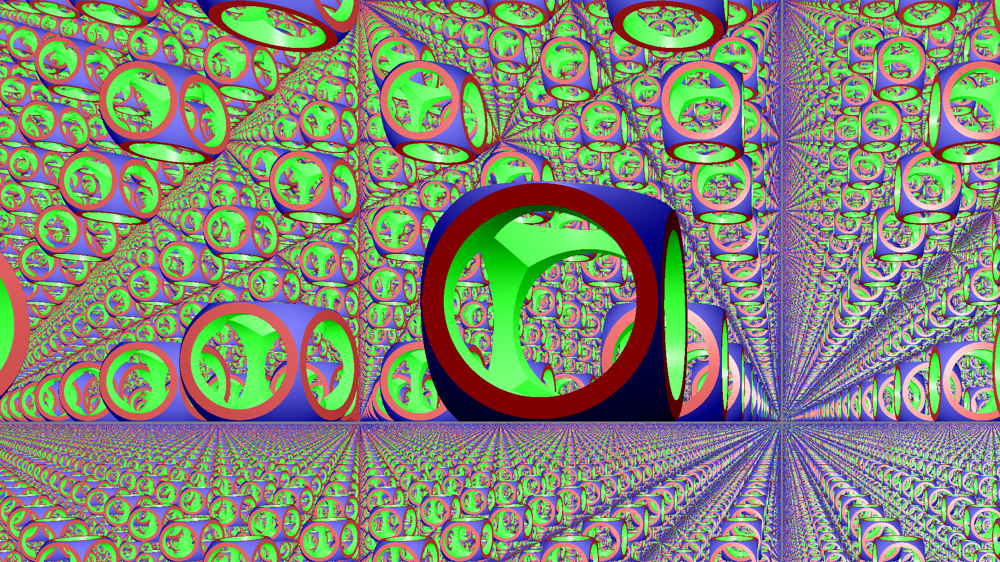
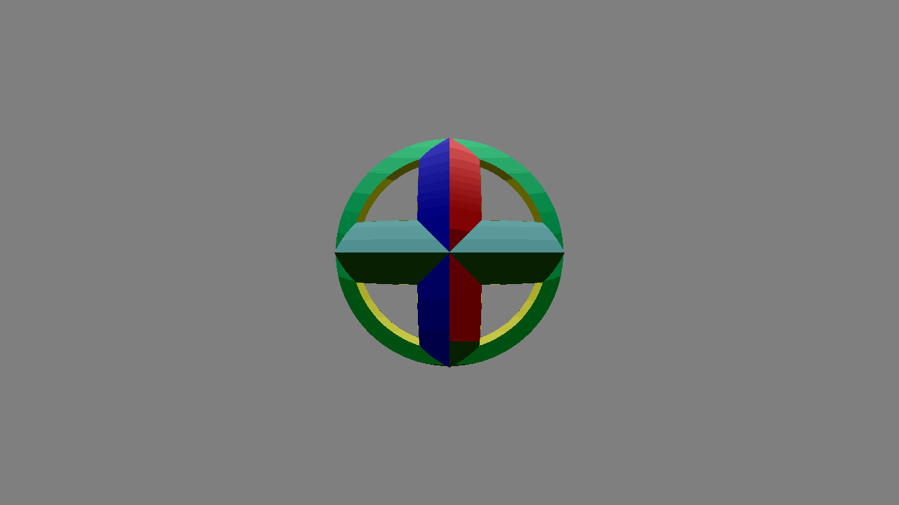

# SDF Sphere Tracing Renderer

A software 3D renderer written in **C++** that combines a classic rasterization pipeline with **sphere tracing on signed distance functions (SDFs)**. A full-screen quad is rasterized, and each fragment is shaded by sphere-tracing a ray through a scene of implicit surfaces — at each step the ray advances by exactly the current SDF distance (guaranteeing no overshoot), rather than a fixed-size step. This is the same approach used in many real-time shader-based renderers (Shadertoy-style), implemented here entirely on the CPU.

<!-- Add a render here, e.g.: -->


## Features

- **Custom rendering pipeline** — vertex shader → rasterizer (with back-face culling, AABB clipping, barycentric interpolation) → fragment shader, mirroring a GPU pipeline in software.
- **Sphere-traced fragment shader** — each pixel casts a ray from the camera and advances it through the scene by the minimum SDF distance to any object at each step, with early termination once the surface is reached (distance < epsilon).
- **Primitives** — sphere, box, and capped cylinder, each defined by an exact or bound signed distance function and its analytic gradient (used as the surface normal).
- **CSG operations** — `Union`, `Intersect`, `Substract`, plus smooth variants (`SmoothUnion`, `SmoothIntersection`, `SmoothSubstraction`) that blend surfaces continuously instead of with a hard edge.
- **Space repetition** — `RepeatOp` tiles any element infinitely along chosen axes, enabling patterns from a single primitive.
- **Phong shading** — ambient, diffuse and specular terms computed per-fragment from the SDF gradient and the light/camera positions; each primitive carries its own material parameters.
- **Parallelized** — vertex processing and fragment shading are parallelized with OpenMP.
- **Two output modes**:
  - Static renders exported to **PNG** (via `stb_image_write`).
  - Animated scenes exported to **GIF** (via `gif.h`), with scene parameters driven by a time variable.



## Project structure

| File | Role |
|---|---|
| `vect.hpp` | Vector/matrix math primitives (`vec2f`, `vec3f`, `vec4f`, `vec3i`, operators) |
| `elements.hpp` | `Element` base class, primitives (`Sphere`, `Box`, `CappedCylinder`), and CSG operations |
| `pipeline.hpp` | The rendering pipeline: vertex shader, rasterizer, ray-marching fragment shader |
| `temp_mem.hpp` | Lightweight scene-graph helpers (`makeTemp`, `addScene`) for building a scene without manual memory management |
| `scenes.hpp` | Static scene definitions (`getSceneData0` … `getSceneData6`) |
| `animated_scenes.hpp` | Animated scene definitions, parameterized by time |
| `main.cpp` | Entry point for static PNG renders |
| `animation.cpp` | Entry point for animated GIF renders |
| `stb_image_write.h`, `gif.h` | Third-party single-header libraries for PNG/GIF encoding |

## Building & running

A `Makefile` is provided:

```bash
make        # build and render the static scene defined in main.cpp -> result.png
make anim   # build and render the animated scene defined in animation.cpp -> result.gif
make clean  # remove build artifacts
```



Requires a C++ compiler with OpenMP support (e.g. `g++`).

## Choosing a scene

- **Static renders**: in `main.cpp`, change the call `getSceneData5()` to any other `getSceneDataX()` defined in `scenes.hpp`.
- **Animations**: in `animation.cpp`, change the call `animateSceneData4(time)` to any other `animateSceneDataX(time)` defined in `animated_scenes.hpp`.

Scenes are built declaratively: primitives are created with `makeTemp(Type, name, (constructor args))`, combined through CSG operators, and added to the scene with `addScene(name)`.

## Team & contribution

This was a **team project**, developed with Jules D. and Axelle D.
The full source code and commit history live in the original team repository, which is private.

## Notes

This project was built as part of a software 3D rendering pipeline course, exploring how a rasterization pipeline and implicit-surface ray marching can be combined in a single CPU renderer — including the geometric reasoning needed to position primitives correctly for CSG results like rings and repeated patterns.
